# git_cheet_sheet

## github repository link

- [Link](https://github.com/cpm0722/git_cheet_sheet)  

## init

- github 이름을 갖는 디렉터리를 생성한 후 이를 git으로 관리하고자 한다.  
이 때 git init 명령어를 사용하게 된다. git init은 해당 레퍼지토리 내에 .git이라는 숨겨진 디렉터리를 생성해 해당 레퍼지토리를 git으로 관리하게 된다.  
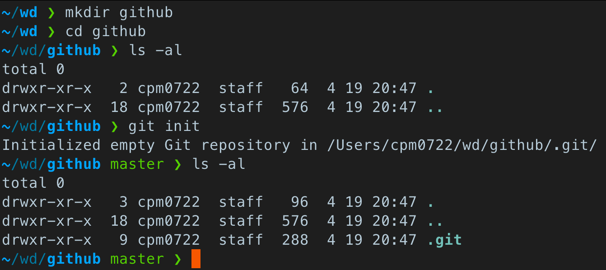  

- 명령어 설명  
    - 일반 디렉터리를 git 레퍼지토리로 변경하는 명령어  

- 명령어 옵션  
    | 명령어 | 설명 |  
    | :---: | :---: |  
    | `git init` | 일반 디렉터리를 git 레퍼지토리로 변경 |  

## remote

- github로 git 레퍼지토리를 관리하기 위해 github에서 새로운 repository를 생성한다. 이 때, README.md 파일이 기본적으로 생성되도록 체크한다.  
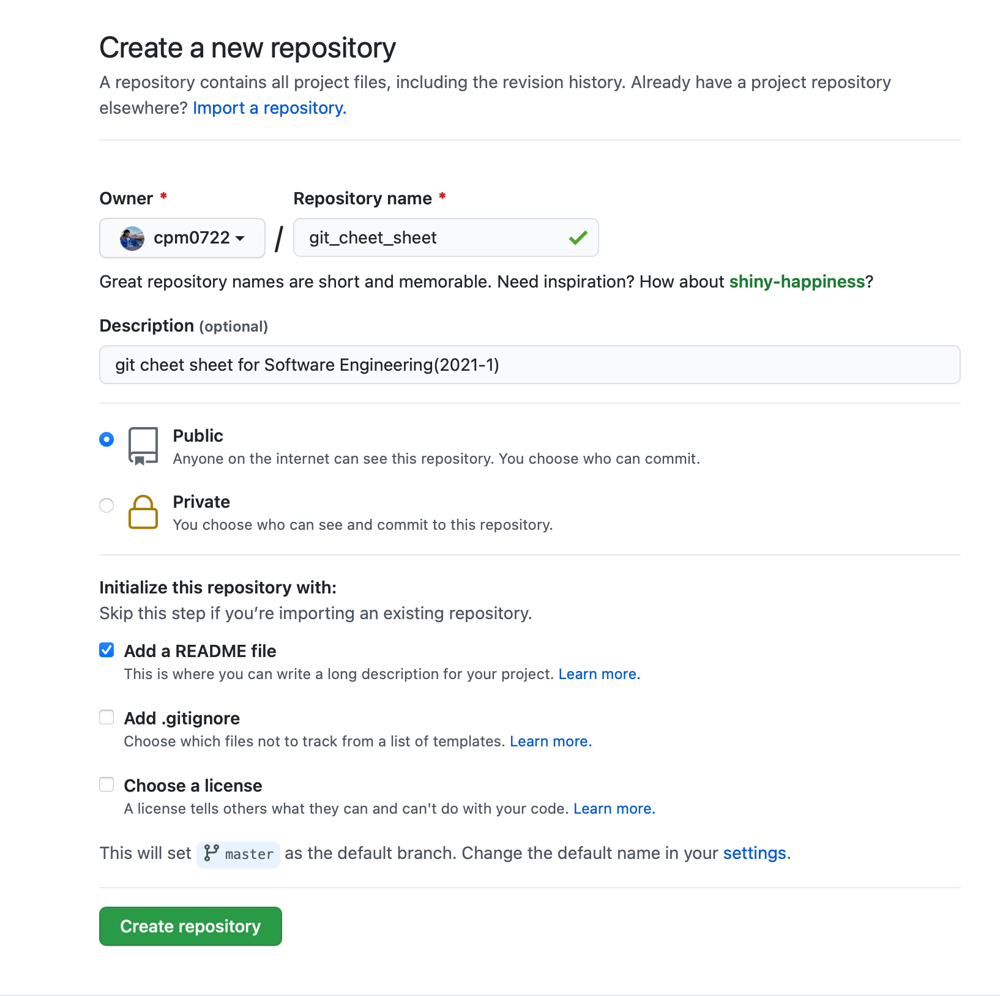  

- git 레퍼지토리에서 git remote 명령어를 사용해 현재 remote 저장소 목록을 확인한다. 비어 있는 것을 확인할 수 있다. remote add 명령어를 사용해 origin 저장소로 github 레퍼지토리 주소를 추가한다.  
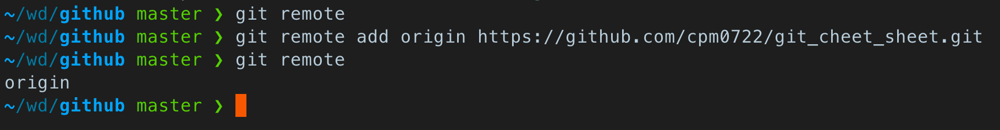  

- 명령어 설명
    - git remote 저장소를 관리하는 명령어  

- 명령어 옵션  
    | 명령어 | 설명 |  
    | :---: | :---: |  
    | `git remote` | remote 저장소 목록 출력 |  
    | `git remote -v` | remote 저장소 목록에 url도 함께 출력 |  
    | `git remote add [name] [url]` | [url]을 [name] 이름을 갖는 remote 저장소로 추가 |  
    | `git remote remove [name]` | [name] 이름을 갖는 remote 저장소를 제거 |  

## add

- 빈 markdown.md 파일을 새로 생성한 후 git add 명령어를 사용해 git으로 관리하도록 등록한다.
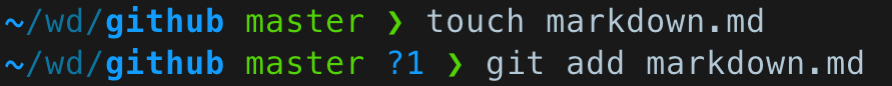  

- 명령어 설명  
    - 파일의 현재 상태를 git의 Staging Area에 추가하는 명령어  
    - git에서 관리하지 않는(untracked) 파일을 처음 등록하거나 이미 관리 중이었던 파일의 현재 상태를 추가  

- 명령어 옵션  
    | 명령어 | 설명 |  
    | :---: | :---: |  
    | `git add [file_list]` | file_list들을 Staging Area에 추가 |  
    | `git add *` | 현재 디렉터리 하위 모든 파일들을 Staging Area에 추가 |  
    | `git add .` | 현재 디렉터리 숨김파일 포함 하위 모든 파일들을 Staging Area에 추가 |  

## commit  

- markdown.md를 추가한 현재 상태를 commit 이미지로 생성한다. commit 메세지는 "add empty file: markdown.md"로 한다.  
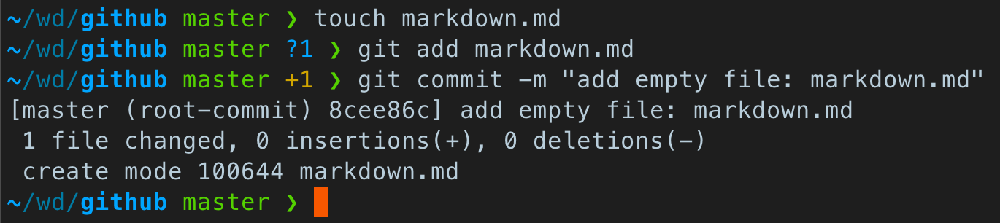

- 명령어 설명  
    - 현재 Staging Area를 commit 이미지로 생성하는 명령어  

- 명령어 옵션
    | 명령어 | 설명 |  
    | :---: | :---: |  
    | `git commit -m "commit message"` | commit message를 포함해 commit 이미지를 생성 |  
    | `git commit -a` | git이 추적하는(tracked) 파일들을 add 후 commit |  
    | `git commit -v` | commit message의 git diff 정보를 삽입 |  
    | `git commit --amend` | 가장 최근의 commit 덮어쓰기 |  

## config

- github 원격 저장소를 갱신하기 위해서는 현재 로컬 git 레퍼지토리의 것을 push해야 한다. 하지만 처음 git을 설치한 뒤 이름, 이메일 등을 설정하지 않은 상태로는 원격 저장소에 push할 수 없다. git config 명령어를 사용해 이름, 이메일, 사용 editor등을 등록한다.  
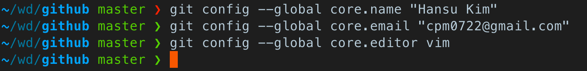  

- 명령어 설명  
    - git의 설정을 관리하는 명령어  

- 명령어 옵션  
    | 명령어 | 설명 |  
    | :---: | :---: |  
    | `git config --global user.name "name"` | 자신의 이름을 등록 |  
    | `git config --global user.email "email"` | 자신의 이메일을 등록 |  
    | `git config --global core.editor [editor]` | git에서 사용할 editor(vim, nano 등)을 등록 |  
    | `git config --global alias.ex example` | git에서 example 명령어를 ex로 축약해 사용하도록 alias 등록 |  
    | `git config --list` | git에 설정한 내역들을 출력 |  

## push  

- github 원격 저장소에 로컬 git 레퍼지토리의 내용을 업로드한다. 하지만 push가 실패한다. github의 최신 commit보다 로컬 git 레퍼지토리의 commit이 더 최신 버전이 아니기 때문이다.  
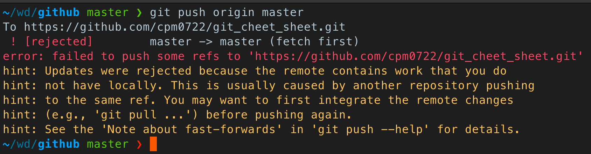

- 명령어 설명  
    - 원격 저장소에 로컬 git 레퍼지토리의 최신 commit을 추가하는 명령어  

- 명령어 옵션  
    | 명령어 | 설명 |  
    | :---: | :---: |  
    | `git push [remote] [local_branch]` | remote 저장소에 local_branch의 최신 commit을 추가 |  
    | `git push [remote] --delete [remote_branch]` | remote 저장소에서 remote_branch를 제거 |  

## pull  

- push의 에러 메세지에서 제시한 해결책 중 pull 명령어를 사용해본다. 하지만 pull 역시 실패한다. remote 저장소의 최신 commit (README.md가 생성된 commit)과 로컬 git 레퍼지토리의 최신 commit (markdown.md가 생성된 commit)이 서로 연관이 없기 (공통 조상 commit이 없기) 때문에 pull 역시 불가능하다.  
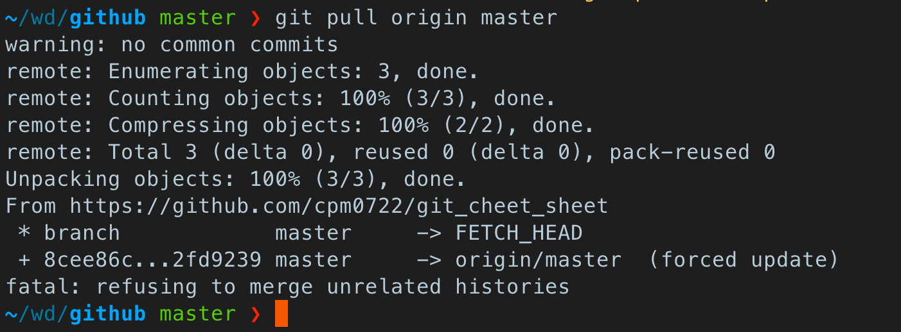  

- 명령어 설명  
    - remote 저장소의 최신 commit으로 로컬 git 레퍼지토리의 최신 commit(HEAD)을 갱신하는 명령어  
- 명령어 옵션  
    | 명령어 | 설명 |  
    | :---: | :---: |  
    | `git pull [remote] (remote_branch)` | remote의 remote_branch를 로컬 git 레퍼지토리에 pull |  

## clone  

- 이러한 현상을 해결하기 위해서는 github 원격 저장소의 레퍼지토리를 로컬로 복제해온 뒤, 해당 레퍼지토리의 commit에 이어서 commit을 생성해나가야 한다.  따라서 임시로 github_v2 디렉터리르 생성하며 원격 저장소의 레퍼지토리를 복제한 뒤 기존에 작성했던 markdown.md 파일을 복사한다.  
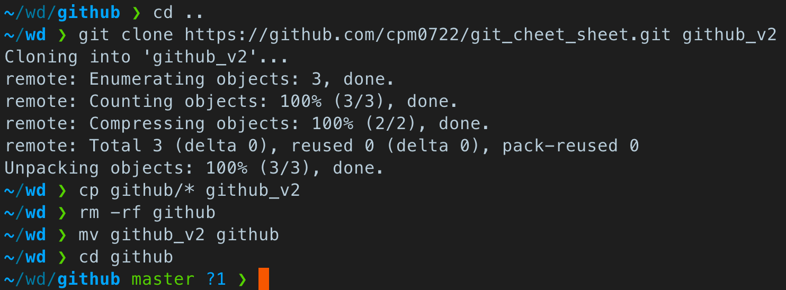  

- 명령어 설명  
    - 원격 저장소의 레퍼지토리를 로컬로 그대로 복제하는 명령어  

- 명령어 옵션  
    | 명령어 | 설명 |  
    | :---: | :---: |  
    | `git clone [remote_url] (dir_name)` | remote_url의 원격 레퍼지토리를 dir_name의 로컬 디렉터리로 복제 |  

## status

- markdown.md 파일이 제대로 git에서 관리되고 있는지 확인하기 위해 status 명령어를 사용한다. 복사한 직후에는 "untracked"이지만, add 이후에는 "changes to be commited" (staged)이고, commit 이후에는 아무 내역도 출력되지 않는다.  
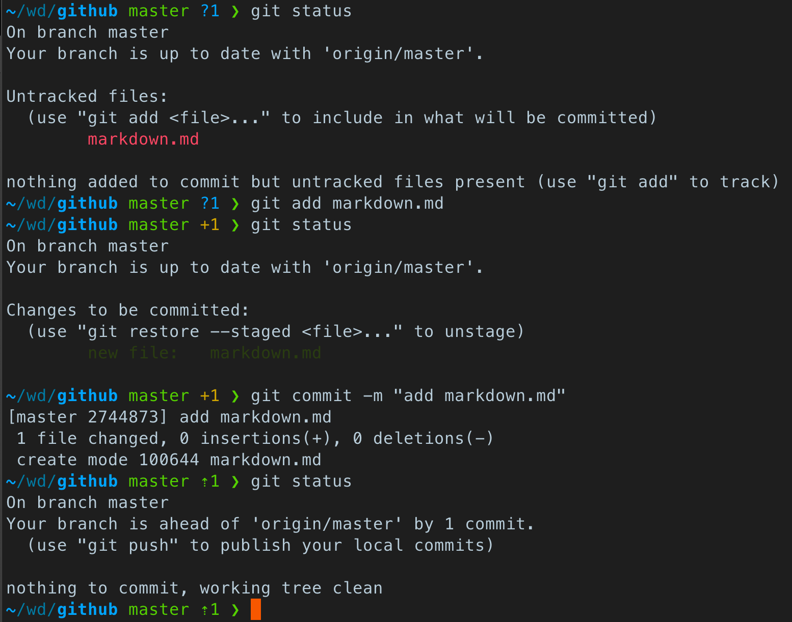

- push를 진행할 경우 성공적으로 원격 레퍼지토리가 갱신된다.  
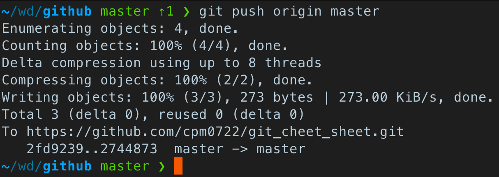  

- 명령어 설명  
    - 현재 디렉터리 하위 모든 파일들에 대해 각각 현재 git에서 관리되는 상태를 출력하는 명령어  

- 명령어 옵션  
    | 명령어 | 설명 |  
    | :---: | :---: |  
    | `git status` | 현재 디렉터리 하위 모든 파일들에 대해 각각의 git 상태를 출력 |  
    | `git status [file_name]` | file_name 파일에 대해 각각의 git 상태를 출력 |  

## log  

- commit 기록을 확인하기 위해 log 명령어를 사용해 확인한다.  
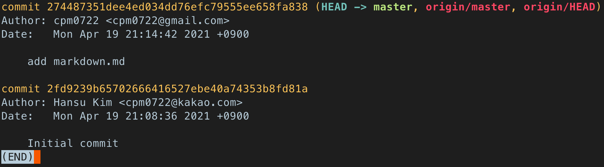

- 명령어 설명  
    - git의 commit history(log)를 확인하는 명령어  

- 명령어 옵션  
    | 명령어 | 설명 |  
    | :---: | :---: |  
    | `git log` | log 출력 |  
    | `git log -p` | diff 정보 함께 출력 |  
    | `git log -N` | 최근 N개의 log만 출력 |  
    | `git log --stat` | 파일 수정 통계 함께 출력 |  
    | `git log --pretty=oneline` | 각 commit을 한 행으로 정렬해 출력 |  
    | `git log --graph` | commit 사이 관계를 graph로 출력 |  
    | `git log --all` | 관련 branch들을 모두 표시 |  

## branch

- markdown을 갱신한다. heading, paragraphs, line breaks, emphasis 항목들을 추가한 뒤 add와 commit을 수행한다.  
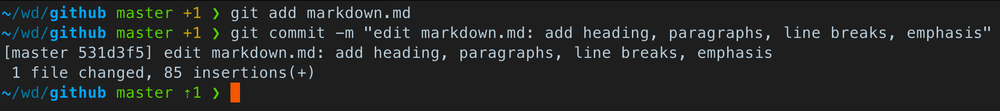  

- line break 후 빈 행이 필요없다는 사실을 확인해 빈 행들을 모두 지우는 작업을 수행할 branch를 새로 생성한다. branch명은 delete_empty_line이다. git branch를 사용해 branch를 생성한 뒤 branch 목록을 확인한다.  
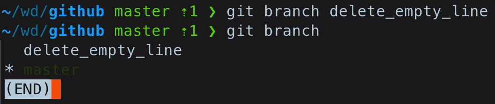  

- 명령어 설명  
    - branch를 추가, 삭제, 확인하는 명령어  

- 명령어 옵션  
    | 명령어 | 설명 |  
    | :---: | :---: |  
    | `git branch` | branch 목록 출력 |  
    | `git [branch_name]` | branch_name branch를 생성 |  
    | `git branch -v` | 각 branch의 마지막 commit 출력 |  
    | `git -d [branch_name]` | branch_name branch를 제거 |  

## checkout

- branch를 생성했다고 해서 바로 해당 branch로 이동하는 것은 아니다. 현재 master branch에서 delete_empty_line branch로 이동하기 위해 git checkout 명령어를 사용한다.  
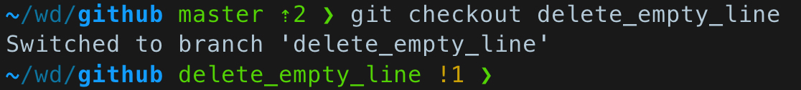  

- delete_empty_line branch에서 markdown.md를 수정한다. 불필요한 빈 행을 제거한 뒤 add, commit을 수행해 새로운 commit을 생성한다.  이후 checkout 명령어를 사용해 다시 master branch로 복귀한다.  
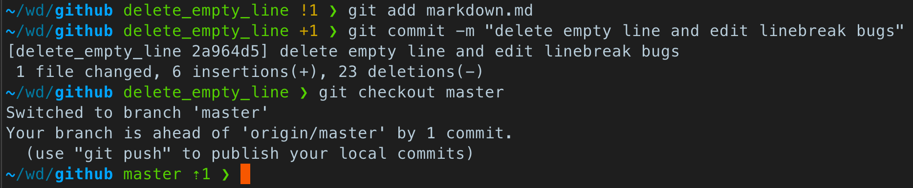

- 이번에는 master branch에서 markdown.md를 수정한다. blockquotes, lists 항목들을 작성한다. 이후 add, commit을 수행해 commit을 생성한다.  
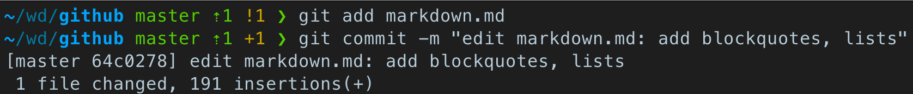

- 명령어 설명  
    - branch를 변경하는 명령어  

- 명령어 옵션  
    | 명령어 | 설명 |  
    | :---: | :---: |  
    | `git checkout [branch_name]` | branch를 branch_name로 변경 |  
    | `git checkout -b [branch_name]` | branch_name branch를 생성한 뒤 branch를 변경 |  

## merge  

- 현재 branch는 master이다. master를 delete_empty_line branch와 병합한다. merge 명령어를 사용한다. merge가 완료된 commit이 생성되고, master branch의 HEAD는 해당 commit으로 이동한다. delete_empty_line의 HEAD는 이전의 commit에 그대로 남아있게 된다. log 명령어를 사용해 master의 HEAD가 이동한 것을 확인한다.  
    - merge 수행  
    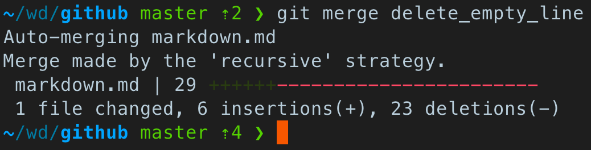  
    - log 수행  
    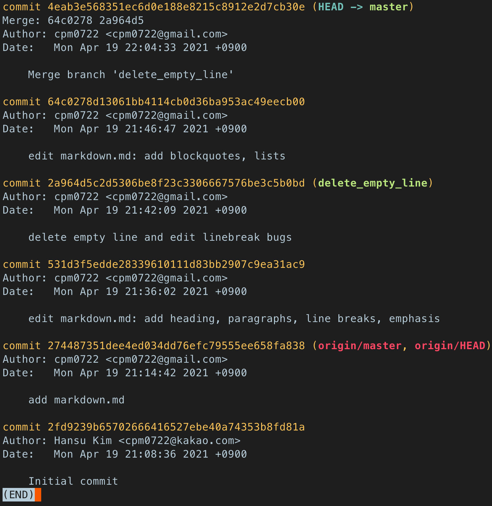  

- delete_empty_line branch는 더이상 사용할 일이 없으므로 branch -d 명령어를 사용해 branch를 제거한다. delete_empty_line branch에 존재하던 commit들이 삭제되지는 않는다. master branch와 merge가 되었기 때문에 해당 commit들은 master branch의 history에 포함되었기 때문이다.  
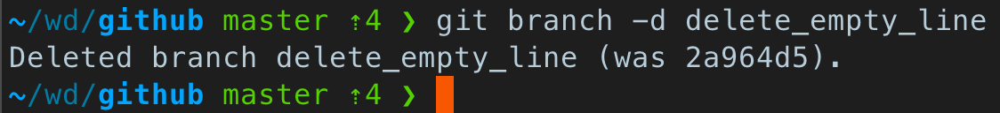

- 명령어 설명  
    - 현재 branch와 다른 branch를 병합하는 명령어  

- 명령어 옵션  
    | 명령어 | 설명 |  
    | :---: | :---: |  
    | `git merge [branch_name]` | 현재 branch(HEAD)와 branch_name을 병합 |  

## rebase  

- markdown.md에 나머지 항목들을 작성하기 위해 add_others branch를 생성하고 commit을 추가한다. branch 생성 및 이동을 함께 하기 위해 branch -b 명령어를 사용하고, 파일을 수정한 뒤 add, commit으로 commit을 생성한다.  
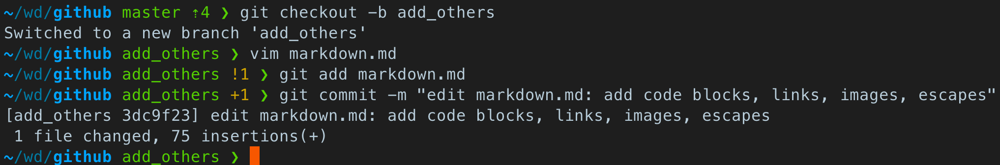  

- 다시 master branch로 돌아와 line break 오류를 수정한다. checkout으로 master branch로 돌아온 뒤 파일을 수정하고, add, commit으로 commit을 생성한다.  
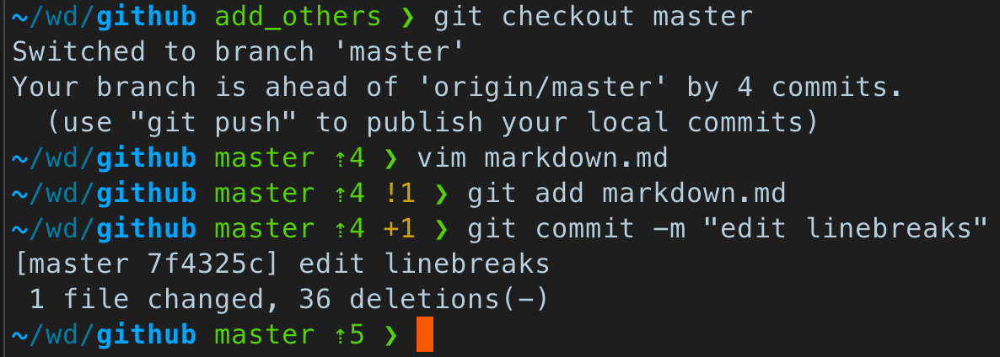  

- 다시 add_others branch로 이동한 뒤 master branch와 rebase한다. master와 add_others의 공통 조상 이후 add_others branch의 commit들(이 경우에는 "edit markdown.md: add code blocks, ..." commit 1개)가 master branch의 HEAD commit 이후에 추가되게 된다. rebase 과정에서 conflict(두 branch 수정된 내용이 겹침)가 발생했다. git status 명령어를 사용해 확인하면 markdown.md가 "both modified"상태라는 것을 확인할 수 있다.  
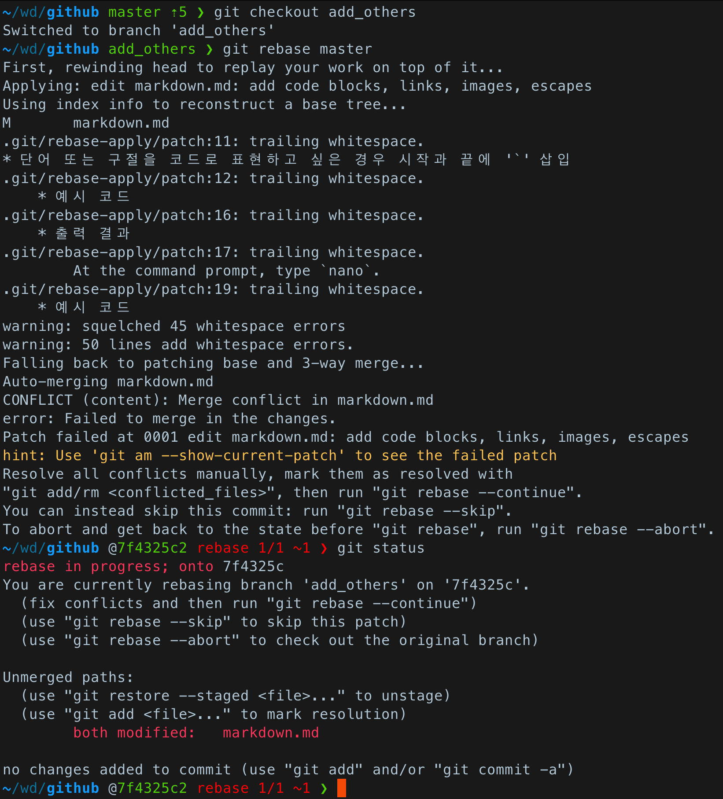  

- markdown.md 파일을 수정해 conflict를 해결한 뒤, add, commit으로 rebase를 완료한다.  
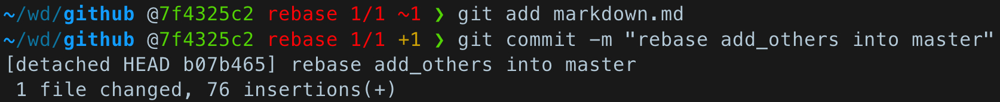  

- rebase는 완료되었지만, rebase 완료 commit은 임시로 생성된 @b07b46458 branch이 가리키고 있다. master branch를 해당 commit으로 이동시키기 위해 checkout으로 master branch로 이동한 뒤, @b07b46458 branch와 merge한다. 이후 log --all 명령어를 사용해 branch 위치를 확인한다.  
    - checkout, merge 수행  
    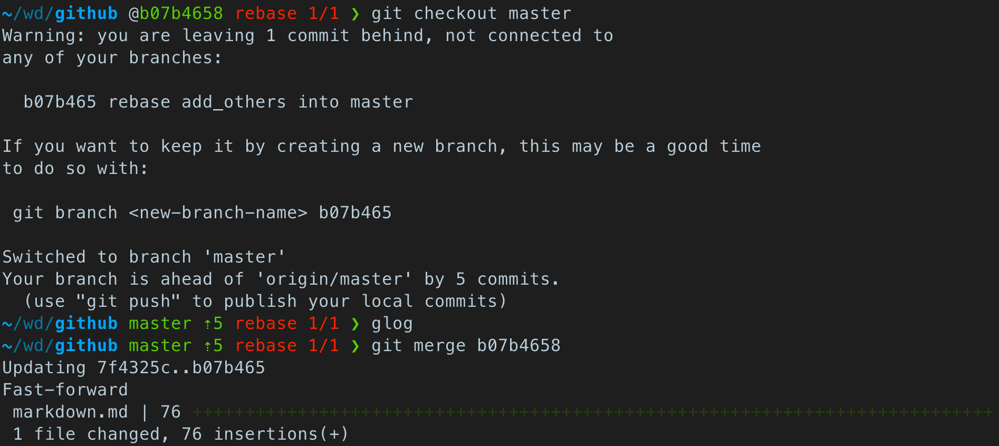  
    - `log --all` 출력 결과  
    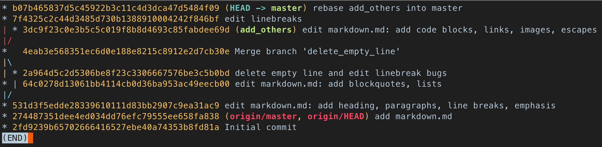  

- 같은 작업을 add_others branch에 대해서 수행한다.  
    - checkout, merge 수행  
    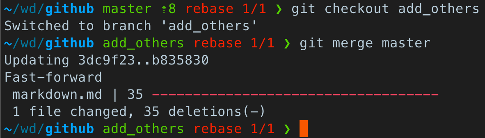
    - `log --all` 출력 결과  
    

- madd_others branch를 branch -D 명령어를 사용해 제거한다.  
    - `branch -D` 수행  
    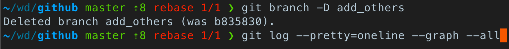
    - `log --all` 출력 결과  
    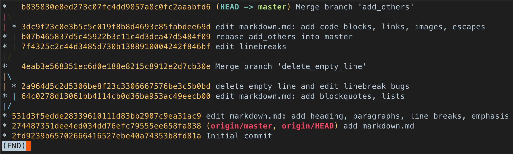

- 명령어 설명  
    - 현재 branch와 다른 branch의 공통이 아닌 최신 commit들을 다른 branch의 HEAD 뒤에 연결하는 명령어  

- 명령어 옵션  
    | 명령어 | 설명 |  
    | :---: | :---: |  
    | `git rebase [branch_name]` | 현재 branch(HEAD)와 branch_name의 공통이 아닌 최신 commit들을 branch_name의 HEAD 이후에 연결 |  

## tag  
- 현재 가장 최신 commit에 대해 finish라는 tag를 부여하기로 한다. tag 명령어를 사용한다. 이후 tag 명령어를 사용해 현재 tag 목록들을 확인하고, log 명령어로 tag가 정상적으로 부여됐는지 확인한다.  
    - tag 명령어 수행  
    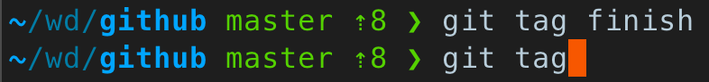  
    - `git tag` 출력 결과  
    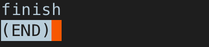  
    - `log --all` 출력 결과  
    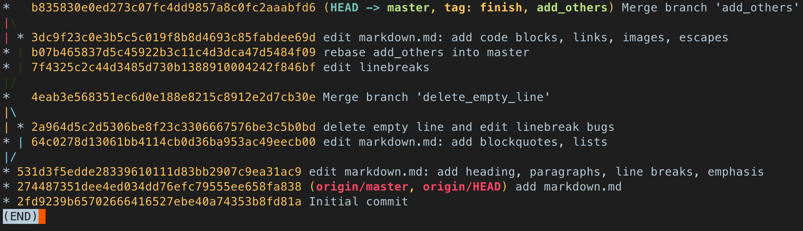  

- 명령어 설명  
    - tag를 관리하는 명령어  

- 명령어 옵션  
    | 명령어 | 설명 |  
    | :---: | :---: |  
    | `git tag` | tag 목록 출력 |  
    | `git tag [tag_name]` | tag_name tag를 HEAD에 추가 |  
    | `git tag -a [tag_name] -m "message"` | tag_name tag를 HEAD에 추가하며 "message" 작성 |  

## reset--hard  

- markdown.md를 수정한다. 하지만 실수로 많은 내용을 지운 상태로 저장해버려 다시 이전 상태로 복원하고 싶다. 이 때 finish tag로 로컬 git 레퍼지토리 내 파일들을 복구하기 위해 reset --hard 명령어를 사용한다.  
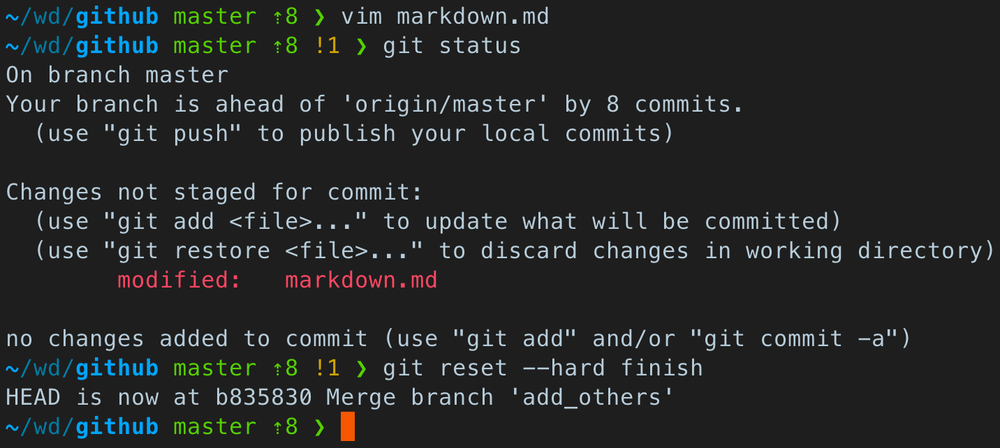

- finish tag를 지우기 위해 tag -d 명령어를 사용한다. 이후 log 명령어로 tag가 제거됐는지 확인한다.  
    - `tag -d` 실행  
    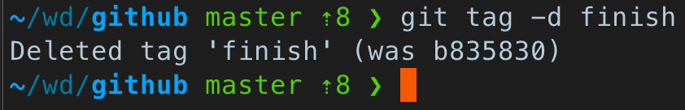  
    - `log` 출력 결과  
    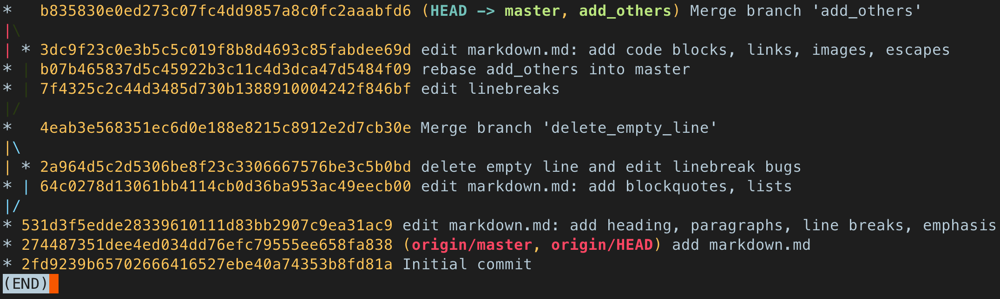  

- 마지막으로 로컬 git 레퍼지토리의 상태를 github 원격 저장소에 push한다.  
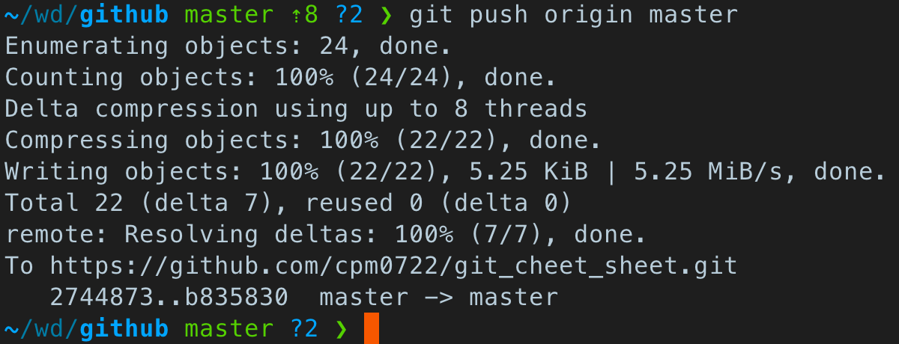  

## 명령어 사용 여부 표

| 명령어 | 사용 여부 | 사용 링크 |  
| :---: | :---: | :---: |  
| add | O | [add](#add) |  
| branch | O | [branch](#branch) |  
| checkout | O | [checkout](#checkout) |  
| clone | O | [clone](#clone) |  
| commit | O | [commit](#commit) |  
| config | O | [config](#config) |  
| init | O | [init](#init) |  
| log | O | [log](#log) |  
| merge | O | [merge](#merge) |  
| pull | O | [pull](#pull) |  
| push | O | [push](#push) |  
| rebase | O | [rebase](#rebase) |  
| remote | O | [remote](#remote) |  
| reset --hard| O | [reset --hard](#reset--hard) |  
| status | O | [status](#status) |  
| tag | O | [tag](#tag) |  